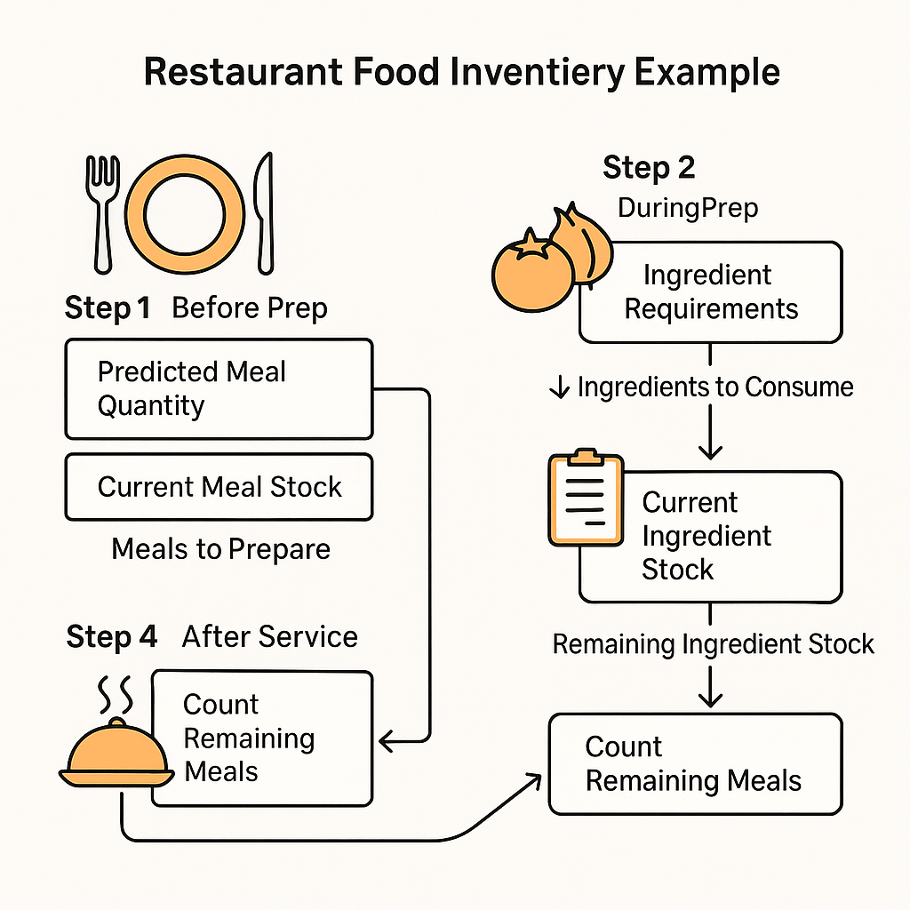

🍽️ Basic Inventory Food Logic
This app helps manage restaurant food inventory based on daily meal preparation and ingredient usage. The logic follows a simple 4-step cycle:

🔁 Daily Inventory Cycle
Step 1: Before Prep
Predicted Meal Quantity: Estimate how many meals are needed today.
(Displayed in the "Prep Suggestion" section)

Current Meal Stock: Count how many meals are leftover from the previous service.
(Manually entered or carried from yesterday's closing count)

Meals to Prepare = Predicted Quantity − Current Stock

➡️ This result is shown in the "Prep Sheet", which tells you how many meals to cook today.

Step 2: During Prep
Use the recipe database to calculate ingredient needs.
For example: 1 meal = 50g tomatoes + 30g onions

Total Ingredients Used = Meals to Prepare × Ingredient Requirements

➡️ This determines how much of each ingredient will be consumed during prep.

Step 3: After Prep
Subtract the used ingredients from the current stock:
Remaining Stock = Current Stock − Ingredients Used

If stock is low, the app triggers a Stock Alert.

➡️ This keeps your ingredient inventory updated in real-time.

Step 4: After Service
Count how many meals are leftover at the end of the day.

This count becomes tomorrow's "Current Meal Stock" in Step 1.

➡️ This cycle repeats daily to ensure smooth operations and accurate inventory tracking.

If stock is low, the app triggers a Stock Alert.

➡️ This keeps your ingredient inventory updated in real-time.

Step 4: After Service
Count how many meals are leftover at the end of the day.

This count becomes tomorrow's "Current Meal Stock" in Step 1.

➡️ This cycle repeats daily to ensure smooth operations and accurate inventory tracking.

🍅 Example: Tomato Sauce
Forecasted Meals: 10

Leftover from Yesterday: 5

Meals to Cook: 10 − 5 = 5

Ingredients per Meal:
1 Tomato Sauce = 50g tomatoes + 30g onions

Total Ingredient Use:
5 meals × (50g + 30g) = 250g tomatoes + 150g onions

Remaining Stock After Prep:
500g − 250g = 250g tomatoes
300g − 150g = 150g onions

Leftover After Service: 3

Tomorrow’s Meals to Cook:
10 (forecast) − 3 (leftover) = 7 meals

🍅 Example: Tomato Sauce
Forecasted Meals: 10

Leftover from Yesterday: 5

Meals to Cook: 10 − 5 = 5

Ingredients per Meal:
1 Tomato Sauce = 50g tomatoes + 30g onions

Total Ingredient Use:
5 meals × (50g + 30g) = 250g tomatoes + 150g onions

Remaining Stock After Prep:
500g − 250g = 250g tomatoes
300g − 150g = 150g onions

Leftover After Service: 3

Tomorrow’s Meals to Cook:
10 (forecast) − 3 (leftover) = 7 meals

